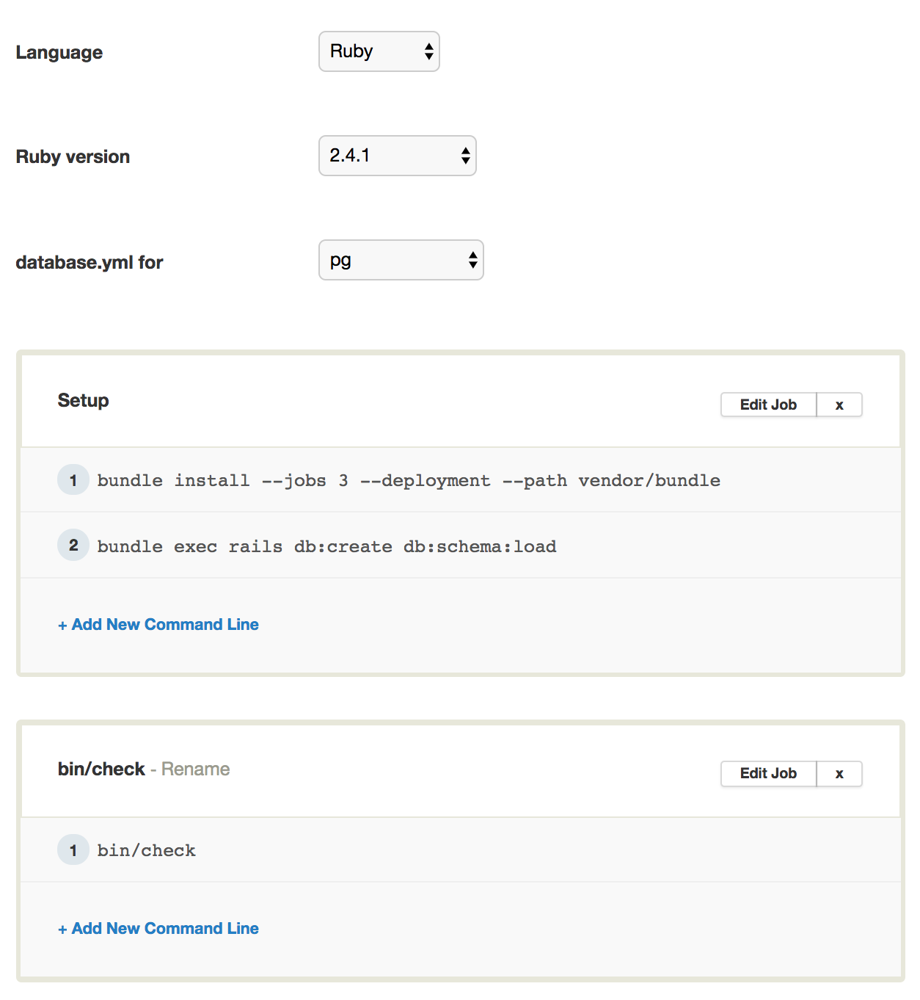

# Configure a CI

At Renuo we **always** use a CI (Continuous Integration) system to test our applications. It's essential to guarantee
that all the tests pass before building and releasing a new version through our CD system. Our private projects use
SemaphoreCI, while OpenSource ones use TravisCI. We try to avoid having many different systems so we'd like if you can
configure one of them and preferably SemaphoreCI, since is, at the moment, our fastest and most reliable system.

Before configuring the CI, you should already have a Git Repository with the code, a `[test command]` to execute, and the main branches already pushed (at least develop and master) and ready to be tested.

* Proceed to <https://semaphoreci.com/> and login or create an account with your Renuo email address.
You should already be part of the Renuo organisation but you may not have permissions to add a project to the organisation.
That's not a problem, you can configure it anyway and ask wg-operations to transfer it to the organisation afterwards (you have 100 free builds)

* Configure your CI to prepare and run your tests, depending on the application you are making the setup of.

* Reconfigure until your build is green
* Run the build for all your branches: `master`, `develop` and `testing`
* Configure your project and in the "Branches" section select:
  * Cancel queued and started builds
  * Priority branches: master, develop, testing (one per line)

Once all builds are green you finished the configuration of the CI.

