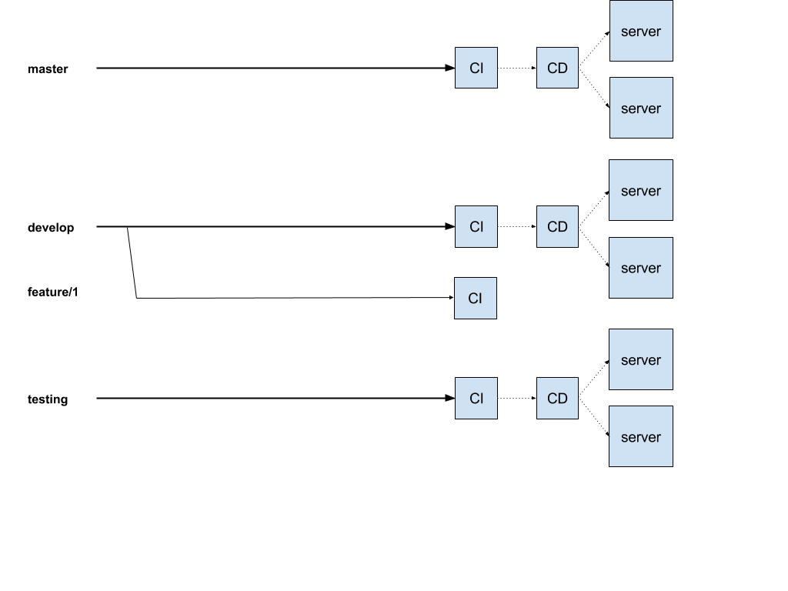

# Gitflow

At Renuo we follow [gitflow convention](http://nvie.com/posts/a-successful-git-branching-model/) and we use it in every project.
Please check it out and read how it works if you don’t know it yet.
It’s very important that you know how gitflow works to work at Renuo.

Since we follow gitflow, we have two main branches connected, via CD, to two servers, we call "main" and "develop".
In addition to these two branches we always add a "testing" branch (and connected server) where developers can merge their features without waiting for a code review.

