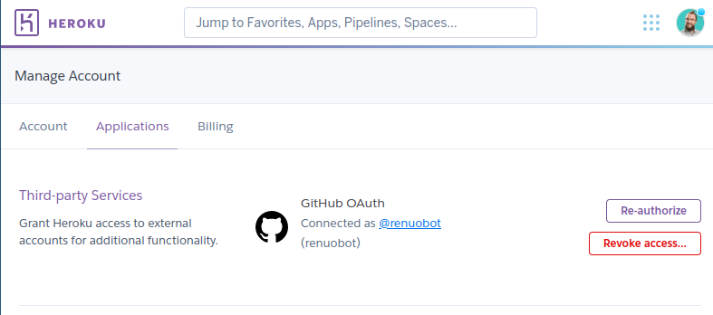
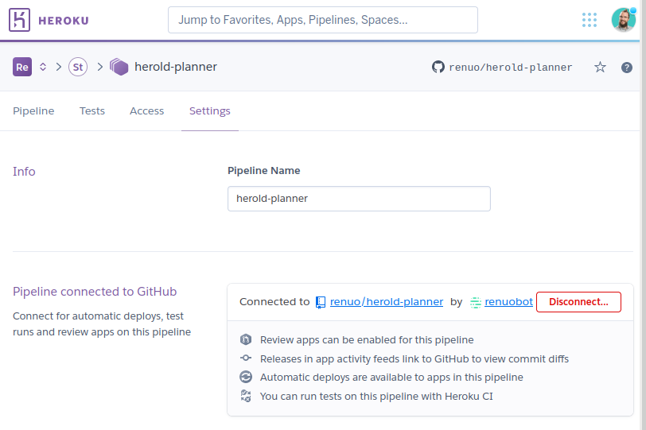

# Heroku

## Review Apps

See also:
 * https://devcenter.heroku.com/articles/github-integration-review-apps

To enable review apps in heroku do the following
 1. Make sure your heroku account is linked with the `@renuobot` GitHub account
    
    For that you need to be logged in as `@renuobot` on GitHub.
 2. Go to your application settings and connect the pipeline to GitHub
    
 3. Enable Review Apps for your application
    
 4. Add an `app.json` to your repository

