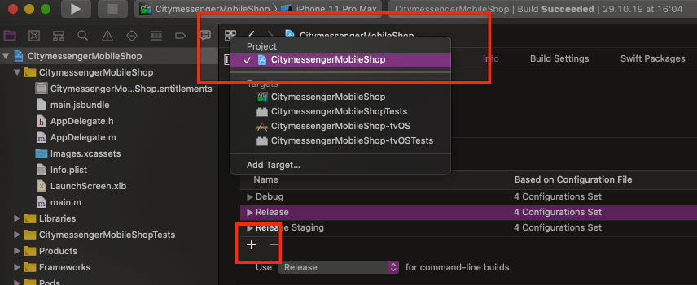

# Release

## iOS

* log in here and create three bundle identifiers - `ch.renuo.[project-name]`, `ch.renuo.[project-name].staging`, `ch.renuo.[project-name].dev`: <https://developer.apple.com/account/resources/identifiers/list>
* make sure to select push notifications in the capabilities if it's needed
* log in there with operations@renuo.ch account
* then as a second step, you need to create the app listing for production & staging apps in <https://appstoreconnect.apple.com/WebObjects/iTunesConnect.woa/ra/ng/app>
* (wait a couple of minutes until the new app identifier is synchronized to all lists)
* click the plus button and select new app
* when you have this, you should be already able to publish the app.
* configure Fastlane (copy & paste the config from another app (e.g.: <https://github.com/renuo/citymessenger/tree/develop/app/fastlane>),
  * change the identifier and run `bundle exec fastlane match development && bundle exec fastlane match appstore`).
  * run it also for the staging app: `APP_BUNDLE_ID="ch.renuo.[project-name]" bundle exec fastlane match development && APP_BUNDLE_ID="ch.renuo.[project-name]" bundle exec fastlane match appstore`
  This will create the certificates an push them to the repo here <https://github.com/renuo/fastlane-ios-certificates>

### Build configuration

Open the Xcode project under `ios/[project-name].xcworkspace`.

* Create a `Release Staging` build configuration.



Click on `Duplicate using Release configuration`.

* Go to `Product -> Scheme -> Manage schemes`.

* Duplicate the scheme `[project-name]`. Edit it.
Select `Shared` and make sure you have selected only `Run`, `Profile`, and `Archive` for `[project-name]` target.
Go through each build step and select `Release Staging` as build configuration.

* Go to the `Build Settings` and click on `All` and `Combined` filters.
  * Look for `Product Bundle Identifiers` and add `.dev` for `Debug` and `.staging` for `Release Staging`.
  * Change the `Provisioning Profile` to match the same identifiers.
  * Add `BUNDLE_DISPLAY_NAME` under `User-Defined variables`. Set app names for each variant.

Fastlane is using the staging scheme to deploy the staging version of the app.

## Android

Prepare your repo like in this commit: <https://github.com/renuo/citymessenger/pull/182/commits/5b7bdc7d2137ffd885ed8fa8f56be1aa3ee550e2>

### Default configuration

```
defaultConfig {
    applicationId "ch.renuo.[project-name]"
    ...
    versionCode Integer.parseInt(System.getenv("BITRISE_BUILD_NUMBER") ?: VERSION_CODE)
    versionName System.getenv("VERSION_NUMBER") ?: VERSION_NUMBER
    resValue "string", "build_config_package", "ch.renuo.[project-name]"
}
```

### Staging build type

In `android/app/build.gradle`:

Define staging build type under `buildTypes`:

```
buildTypes {
    debug {
       applicationIdSuffix ".dev"
    }
    release {
        minifyEnabled enableProguardInReleaseBuilds
        proguardFiles getDefaultProguardFile("proguard-android.txt"), "proguard-rules.pro"
        signingConfig signingConfigs.release
    }
    releasestaging {
        initWith release
        applicationIdSuffix ".staging"
        matchingFallbacks = ['release', 'debug']
    }
}
```

Set up env files mapping at the top of the file:

```
project.ext.envConfigFiles = [
    debug: ".env",
    release: ".env",
    releasestaging: ".env.staging"
]
```

### Signing

Add the following files to `.gitignore`:
```
android/keystore.properties
android/key.json
```

In `android/app/build.gradle`:

Add the release signing config under `signingConfigs`:
```
release {
    if (keystorePasswords['[PROJECT-NAME]_RELEASE_STORE_PASSWORD'] &&
            keystorePasswords['[PROJECT-NAME]_RELEASE_KEY_PASSWORD']) {
        storeFile file([PROJECT-NAME]_RELEASE_STORE_FILE)
        storePassword keystorePasswords['[PROJECT-NAME]_RELEASE_STORE_PASSWORD']
        keyAlias [PROJECT-NAME]_RELEASE_KEY_ALIAS
        keyPassword keystorePasswords['[PROJECT-NAME]_RELEASE_KEY_PASSWORD']
    }
}
```

Add these variables in `android/gradle.properties`:
```
[PROJECT-NAME]_RELEASE_STORE_FILE=../keystores/[project-name].jks
[PROJECT-NAME]_RELEASE_KEY_ALIAS=key0
VERSION_CODE=1
VERSION_NUMBER=0.0.1
```

and load the `keystore.properties` file:

```
def keystorePasswordsFile = rootProject.file("keystore.properties")
def keystorePasswords = new Properties()
keystorePasswords.load(new FileInputStream(keystorePasswordsFile))
```

Prepare three new passwords and add them to the password manager:

* App encrypted secrets password
* Android keystore password
* Android keystore key0

Create a file `keystore.properties` and save the two passwords "Android keystore password" and "Android keystore key0"
there in the following form:

```
APP_RELEASE_STORE_PASSWORD=<Android keystore password>
APP_RELEASE_KEY_PASSWORD=<Android keystore key0>
```

Encrypt this file with the "App encrypted secrets password" to be checked into the git repo:

```
openssl enc -aes-256-cbc -salt -a -in android/keystore.properties -out android/keystore.properties.enc
```

Create a signing key using "Android keystore password" and "Android keystore key0" with the key tool:

```
keytool -genkey -v -keystore [project-name].jks -alias key0 -keyalg RSA -keysize 2048 -validity 10000
```

You need to log in to <https://play.google.com/apps/publish/> with the `google@renuo.ch` account) and create the app there.
You will need much more information for the store listing than for iOS, they require also the screenshots,
etc., otherwise it’s not possible to even make the internal testing build.

* Enable App Signing by Google Play.

* Add a service account to Google and generate a `key.json` file (no other configurations), download it
and encrypt it with the "App encrypted secrets password".

```
openssl enc -aes-256-cbc -salt -a -in android/key.json -out android/key.json.enc
```

* Add the service account to the app users with the role release manager.

When it’s there, it should also just work with `bundle exec fastlane android deploy`
