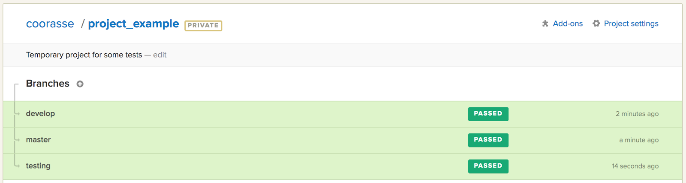

# Configure the CI

At Renuo we **always** use a CI (Continuous Integration) system to test our applications. It's essential to guarantee
that all the tests pass before building and releasing a new version through our CD system. Our projects use
[SemaphoreCI](<https://semaphoreci.com/>).

Before configuring the CI, you should already have a Git Repository with the code, a `bin/check` command to execute,
and the main branches already pushed and ready to be tested.

* Proceed to <https://semaphoreci.com/> and login or create an account with your Renuo email address.
You should already be part of the Renuo organisation but you may not have permissions to add a project to
the organisation. That's not a problem, you can configure it anyway and ask wg-operations to transfer it to
the organisation afterwards (you have 100 free builds)
* Create a project here: <https://semaphoreci.com/organizations/renuo/projects/new>

## Rails specific setup

Check the `[LATEST_NODE_VERSION]` available on https://semaphoreci.com/docs/languages/javascript/javascript-support-on-semaphore.html.

*Setup Job:*

```
git checkout -- .ruby-version
export RAILS_ENV=test
export TZ=Europe/Zurich
bundle install --without production development --deployment --jobs 3 --retry 3
nvm use [LATEST_NODE_VERSION]
bin/yarn install
cp config/application.example.yml config/application.yml
bin/rails db:create db:schema:load
```

*bin/check Job*

```
bin/check
```

* Reconfigure until your build is green
* Run the build for all your branches: `master`, `develop` and `testing`
* Configure your project and in the "Branches" section select:
  * Cancel queued and started builds
  * Priority branches: master, develop, testing (one per line)

When you have your three green builds you have configured your CI properly.



To proceed further we need to create our servers and then configure the Continuous Deployment.
