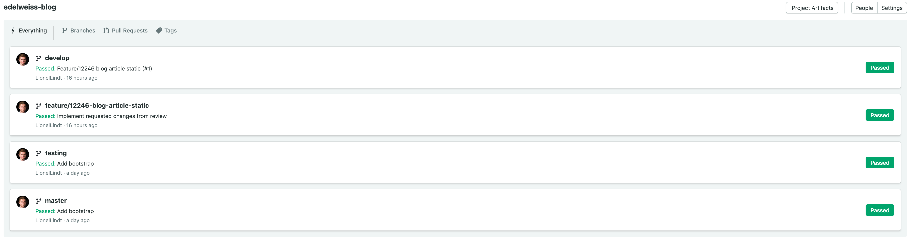

# Configure the CI

At Renuo we **always** use a CI (Continuous Integration) system to test our applications. It's essential to guarantee
that all the tests pass before building and releasing a new version through our CD system. Our projects use
[SemaphoreCI 2.0](<https://semaphoreci.com/>).

Before configuring the CI, you should already have a Git Repository with the code, a `bin/check` command to execute,
and the main branches already pushed and ready to be tested.

* Proceed to <https://renuo.semaphoreci.com/> and login or create an account with your Renuo email address.

* Create a project here: <https://renuo.semaphoreci.com/new_project>

## Rails specific configuration

### Using Renuo CLI:

```
renuo configure-semaphore
```

The command will copy the templates to `.semaphore` folder.

### Manually

1. Create a folder called `.semaphore` in the project root with a file called `semaphore.yml` in it.

1. Take the content of [this template](../templates/.semaphore) and replace [project-name] where
needed.

    This runs a build and a testing process for your code.

1. Add a file called `.nvmrc` to the project root, where you specify the latest node version

1. Head to <https://renuo.semaphoreci.com/secrets> and add a new secret with the name of your project.

1. Commit the files to all three branches, push and watch the CI run.

When you have your three green builds you have configured your CI properly.



To proceed further we need to create our servers and then configure the Continuous Deployment.
