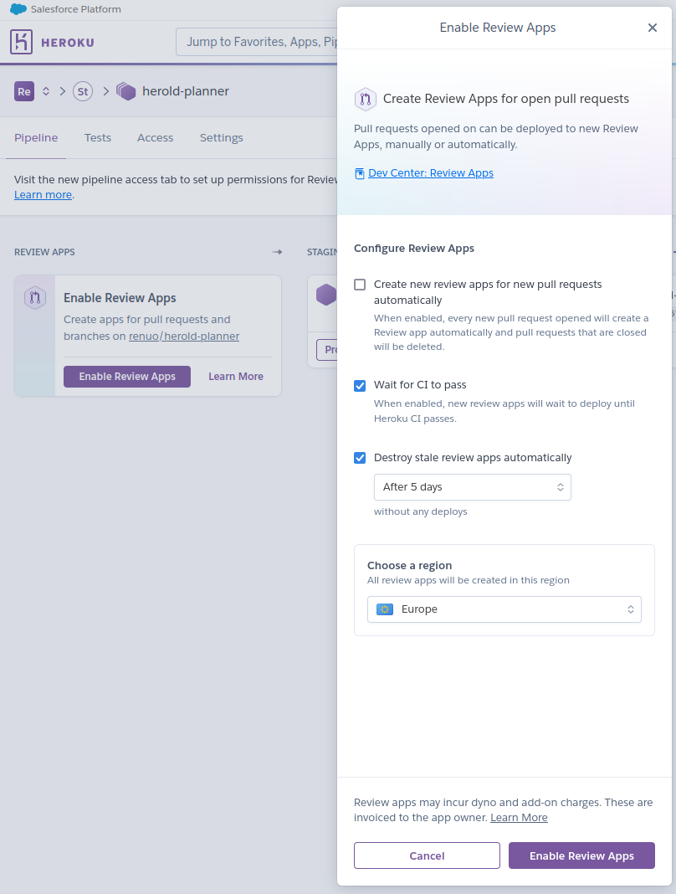

# Setup Heroku Application

## Prerequisites:

* You've [read about what Heroku is](https://www.heroku.com/platform)
* You have a Heroku account.
* You have installed the `renuo-cli` gem

## Setup the remote configuration

Run the command `renuo create-heroku-app [project-name]` to generate a script which will create and configure all
Heroku apps. `[project-name]` string length is limited to 22 characters.

Please review the script before running it and execute only the commands you need and understand.

**If you don't know what a command does: read the documentation and then execute it.**

If you think that the script is outdated please open a
Pull Request on the [renuo-cli](https://github.com/renuo/renuo-cli) project.

## Setup Rails for Heroku

* Add a file called `Procfile` to your code root:

  ```
  web: bundle exec puma -C config/puma.rb
  ```

  It's read by Heroku to start the web app and worker jobs.

* Add a file called `.slugignore` to your code root:

  ```
  /spec
  /.semaphore
  ```

  Like this you can mark files and folders to be excluded from the Heroku slug.

## Review Apps

See also:
 * https://devcenter.heroku.com/articles/github-integration-review-apps

To enable review apps in heroku do the following
 1. Make sure your heroku account is linked with the `@renuobot` GitHub account
    
    For that you need to be logged in as `@renuobot` on GitHub.
 2. Go to your application settings and connect the pipeline to GitHub
    
 3. Enable Review Apps for your application
    
 4. Add an `app.json` to your repository
