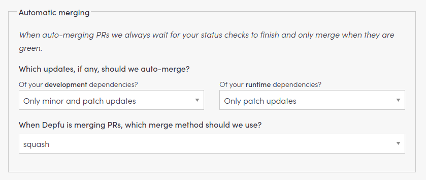

# Depfu

Depfu is a service which checks out the Gemfile / yarn.lock of a project for problematic
dependencies. It will automatically create a pull request to the project
if a security vulnerability has been disclosed.

1. Ask wg-operations to add repository access for Depfu to you new Github
repository.

That's all :-)

Update strategy should be set to `Grouped Updates`, frequency: `monthly`. Assignee should be set.

## Engine Updates

Enable minor engine updates. **Note:** If you are using Heroku, the latest Ruby
/ node version may not yet be available on their platform, so you may need to
delay the upgrade. Check the following GitHub repositories to see if Heroku
added support already:

* <https://github.com/heroku/heroku-buildpack-nodejs>
* <https://github.com/heroku/heroku-buildpack-ruby>

## Automatic merging

To speed up the merging of smaller upgrades (like security fixes) we enable
Automatic merging like this:



Since PRs need to be approved before depfu can merge them we add a GitHub
Actions workflow to automatically approve PRs from depfu:

```yaml
name: Depfu auto-approve
on:
  pull_request_target:
    types: [opened]

permissions:
  contents: write
  pull-requests: write

jobs:
  depfu:
    runs-on: ubuntu-latest
    if: ${{ github.actor == 'depfu[bot]' }}
    steps:
      - name: Approve all depfu PRs
        run: gh pr review --approve "$PR_URL"
        env:
          PR_URL: ${{github.event.pull_request.html_url}}
          GITHUB_TOKEN: ${{secrets.GITHUB_TOKEN}}
```
