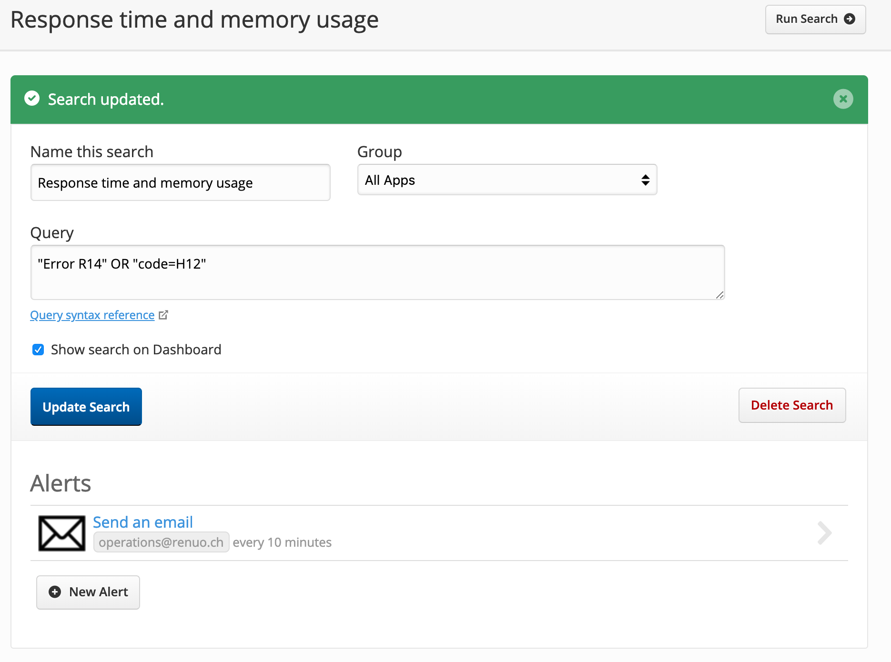
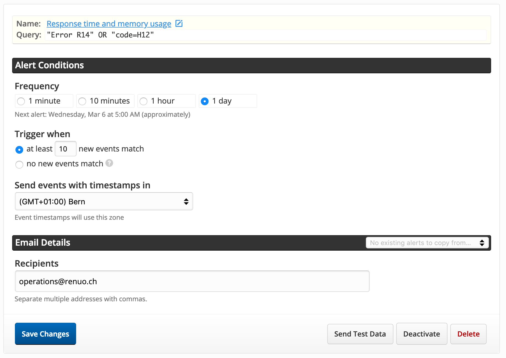

# Papertrail

## Setup Usage Notifications

* Remove admin@renuo.ch from the recipients of the Usage Notifications and add operations@renuo.ch.

## Setup Alerts

* Go to https://dashboard.heroku.com/apps and login with you Renuo account

* Select the App for which you want to set alerts.

* Advance to the `master` branch.

* Select the papertrail add-on and wait until you get redirected.

* Advance to the `Alerts` section.

You should see this prompt:

* Enter the email adress `operations@renuo.ch` and click `Create Alert`.

* Click on the newly created email alert for additional configuration.

Click the litte pen above the query to edit it:

* Name the search `Response time and memory usage`.

* Add the query `"Error R14" OR "code=H12"`.

* Click the `Update Search` button.

After you saw the message that the search was saved successfully, you can click on the newly created email alert to get back to the configuration view from before.

* Set the frequency to `1 Day`.

* Set `Trigger when` to `at least 10 new events match`.

* Set `Send events with timestamps in` to our timezone _(GMT+01:00)Bern_.

* Click on `save changes`.

This is what the final config should look like:

