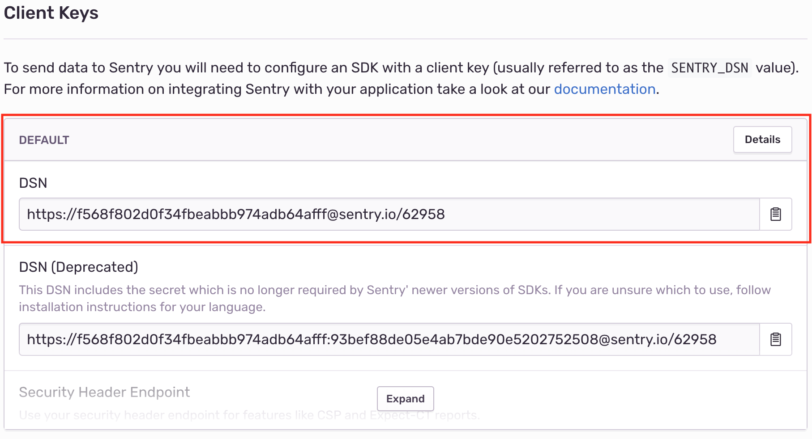

# Sentry

## Setup Monitoring Services

* Go to https://www.sentry.io and login as the renuo monitor.

* Create an entry for each Heroku app (`master`, `develop`, `testing`). Your applications on Sentry should follow the same naming convention as everywhere else.

So: `[project-name]-master`, `[project-name]-develop`, `[project-name]-testing`

* Once you have created an entry, you will see the `dsn key` which you'll need in your config variables on Heroku. Note it.



* Add sentry gem to the project:

```ruby
group :production do
  gem 'sentry-raven'
end
```

* Add `SENTRY_DSN` to `application.example.yml`
* Add `CSP_REPORT_URI` to `application.example.yml`
* Enable CSP Reporting to Sentry in `config/initializers/content_security_policy.rb`:

```ruby
Rails.application.config.content_security_policy do |policy|
  ...

  policy.report_uri ENV['CSP_REPORT_URI']
end
```

You can find the correct value in `Sentry -> Project Settings -> Security Headers -> REPORT URI`.

* Set the variables in all three Heroku environments
* Add a Sentry initializer in `config/initializers` folder. [sentry](../templates/config/initializers/sentry.rb)

* Enable Sentry also on the frontend (javascript) by including [_sentry.html](../templates/app/views/shared/_sentry.html.erb) in your header.

**:warning: The sentry version gets outdated pretty fast so double check it. :warning:**

## Verify the installation

### Ruby

For each Heroku app, connect to the `heroku run rails console --app [project-name]-[branch-name]`:

Once connected, raise an exception and capture it using Sentry:

```
begin
  1 / 0
rescue ZeroDivisionError => exception
  Raven.capture_exception(exception)
end
```

On `https://sentry.io/renuo/[project-name]-[branch-name]` you should find the exception of the ZeroDivisionError.

### Javascript

Open the dev console in chrome, and run

```js
try {
    throw new Error('test raven js');
} catch(e) {
    Raven.captureException(e)
}
```

On `https://sentry.io/renuo/[project-name]-[branch-name]` you should find "Uncaught Error: test raven js".
