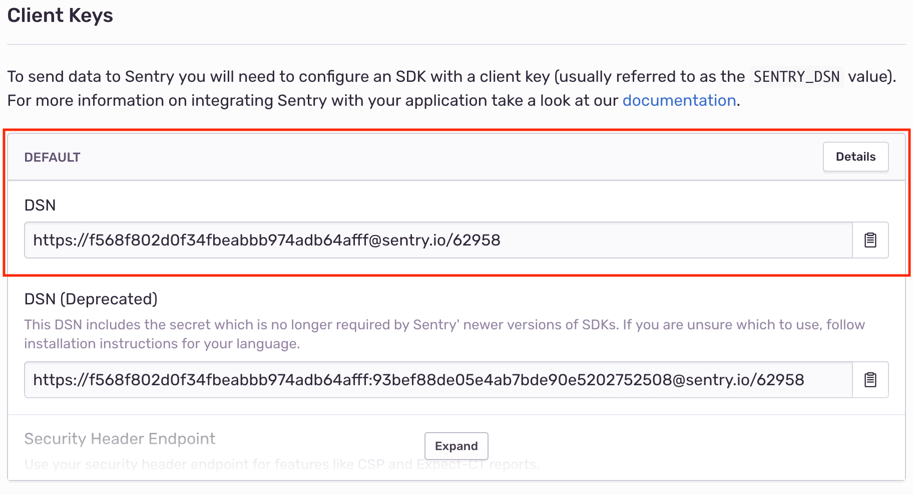

# Sentry

## General configuration

* Go to https://www.sentry.io and login as the renuo monitor user.

* Create a project named `[project-name]`.

* Add the project to the *#renuo* team if the client pays for monitoring, to the `#no-notifications` otherwise.

* Note the DSN key.

  

* Set the Heroku environment variables.
You can use [`renuo configure-sentry project-name <SENTRY_DSN>`](https://github.com/renuo/renuo-cli/blob/main/lib/renuo/cli/app/configure_sentry.rb)
to generate the commands for you.

## Backend (Rails)

* Add sentry gems to the project:

  ```ruby
  group :production do
    gem "sentry-rails"
    gem "sentry-ruby"
    gem "sentry-sidekiq" # If the project uses Sidekiq for background jobs
  end
  ```

* Add a Sentry initializer to your project [`config/initializers/sentry.rb`](../templates/config/initializers/sentry.rb).
* Add `# SENTRY_DSN: 'find_me_on_password_manager'` to `application.example.yml`
* Add `# SENTRY_ENVIRONMENT: 'local'` to `application.example.yml`
* Add `# CSP_REPORT_URI` to `application.example.yml`
* Enable CSP Reporting to Sentry in `config/initializers/content_security_policy.rb` and allow unsafe inline JS:

  ```ruby
  Rails.application.config.content_security_policy do |policy|
    ...
    policy.report_uri ENV['CSP_REPORT_URI'] if ENV['CSP_REPORT_URI']
  end
  ```

  You can find the correct value in `Sentry -> Project Settings -> Security Headers -> REPORT URI`. Add the environment to the `CSP_REPORT_URI` using `&sentry_environment=main`.

## Frontend (Javascript)

* Install the npm package: `yarn add @sentry/browser`
* Include [_sentry.html](../templates/app/views/shared/_sentry.html.erb) in your header.
* Include [sentry.js](../templates/app/javascript/sentry.js) in your JS assets.

## Verify the installation

### Ruby

For each Heroku app, connect to the `heroku run rails console --app [project-name]-[branch-name]` and raise an exception using Sentry:

```
begin
  1 / 0
rescue ZeroDivisionError => exception
  Sentry.capture_exception(exception)
end
```

On `https://sentry.io/renuo/[project-name]` you should find the exception of the ZeroDivisionError.

### Javascript

Open the dev console in chrome, and run

```js
try {
    throw new Error('test sentry js');
} catch(e) {
    Sentry.captureException(e)
}
```

On `https://sentry.io/renuo/[project-name]` you should find "Uncaught Error: test sentry js".
