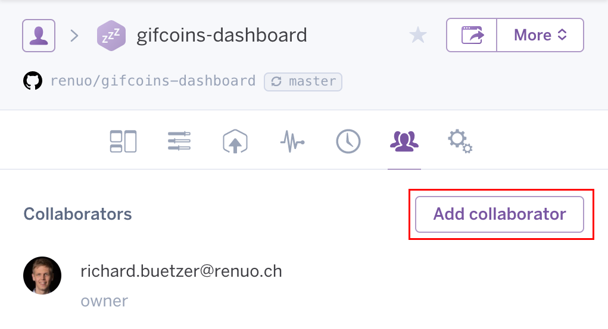
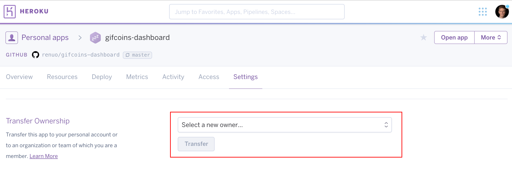
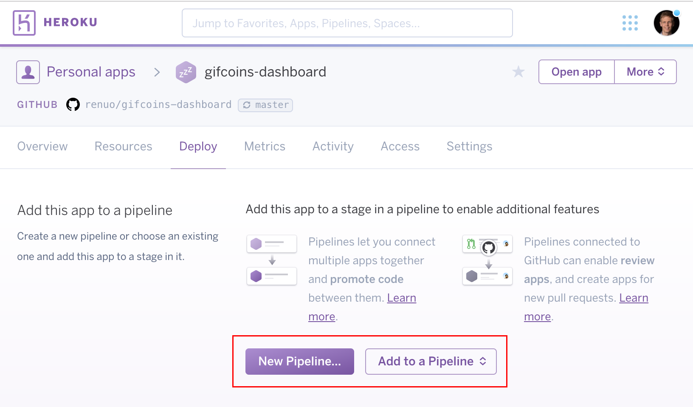

# Setup Heroku Application

It's time to setup a new Heroku Application.
If you don't know what is Heroku please [read it](https://www.heroku.com/platform).

You should have an Heroku Account already. Under the renuo-cli project you can find [a script](https://github.com/renuo/renuo-cli/blob/develop/lib/renuo/cli/app/create_heroku_app)
to generate a script which will create all Heroku apps.
Please review the script before running it and execute only the commands you need and understand.
If you don't know what a command does: read the documentation and then execute it.

If you think that the script is outdated please open a Pull Request.

## Transferring Ownership of the application

After creating a Heroku app, you have to transfer the ownership to `admin@renuo.ch`. This step may already be required
to execute certain commands (like setting a `renuoapp.ch` subdomain) on the Heroku CLI.

Transfer the ownership as follows:

1. Login to [Heroku](https://id.heroku.com/login) and go to your app
1. On the collaborator page, add the collaborator `admin@renuo.ch` 
1. On the settings page, transfer the ownership to `admin@renuo.ch` 
1. If you do not have the credentials for `admin@renuo.ch`, ask wg-operations to accept the transfer of ownership

## Creating a pipeline

Once you have created *Heroku* apps for develop, master and testing, add them to a new pipeline with the same name as your
application.

